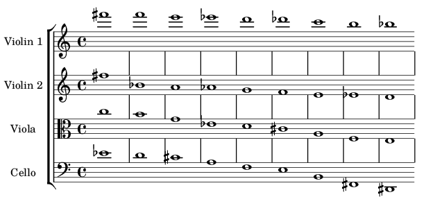

# RELACIONES DE NUBE
	
---

## SUGERENCIA

Estas reglas están destinadas al mayor grado posible de incumplimiento, pero al menor grado posible de autoridad.
	
---

### INSTRUMENTACIÓN

-	1 (Un) cuarteto de cuerdas:

Pueden reemplazarse los instrumentos, siempre y cuando haya alguien en el ensemble que tome el rol de 'viola.'

-	2 (Dos o más) parlantes
	
---

### INICIADORES

Cada intérprete debe reproducir 9 (nueve) sonidos como **INICIADORES**, que pueden o no causar las **Relaciones De Nube**:

1.  Los intérpretes deben utilizar *todas* las siguientes técnicas:
    1.  Sul tasto
    2.  Sul pont
    3.  Arco sobre Cordal/Voluta
    4.  Flautato
    5.  Col legno
    6.  Pizzicato
    7.  Tremolo (*arco* o *pizz*.)
    8.  Vibrato
    9.  Agregar *ruido* con aire (con cualquier vocal o consonante fricativa, <&nbsp;*f*&nbsp;> o <&nbsp;*s*&nbsp;>)
2.  Al menos 3 de las técnicas sugeridas deben *combinarse* de cualquier manera.
3.  Los intérpretes deben utilizar *todas* las siguientes alturas (en esos registros, pero en cualquier cuerda).
    1.  Al menos 3 deben tocarse como *armónicos* (en *cualquier* registro).
    2.  Se pueden usar cuerdas dobles al combinar cualquiera de las alturas.
    3.  El orden de las notas *no debe estar preestablecido.* Tampoco debe seguirse el orden de las notas como están escritas en la siguiente partitura:

	
---

### SEGUIR O NO-SEGUIR

Los intérpretes deben decidir si **SIGUEN** el sonido (de los otros intérpretes o de la pista) o si **NO LO SIGUEN**.

Si *lo siguen*, el sonido reproducido puede ser *cualquier sonido*, excepto las alturas utilizadas como *iniciadoras*:

1.  La acción de *seguir el sonido* se debe llevar a cabo con una idea de *Resonancia*. Esta acción puede significar:
    1.  Extender el sonido.
    2.  Oponerse al sonido.
    3.  Repetir el sonido.
    4.  Fusionarse con el sonido.
    5.  Realizar cualquier otra resonancia que puedan imaginar, con su instrumento, su cuerpo o con cualquier elemento.
2.  La acción de *no seguir el sonido* puede significar:
    1.  Seguir haciendo lo que están haciendo
    2.  Permanecer en silencio
    3.  Iniciar otro sonido.
	
---

### PARÉNTESIS 1

Debe tocarse un *paréntesis* después de que haya pasado la mitad de la obra.

1.  La **viola** debe tocar el **Re** central ***pppp***, sobre la cuerda de Sol, y con una duración de 30-90 segundos.
2.  Los otros tienen que dejar de hacer lo que están haciendo cuando se dan cuenta de que esto está sucediendo, tocar en ***pppp*** utilizando cualquiera de las técnicas indicadas (la duración está determinada por la viola):
    2.  Un intérprete debe *tocar la misma altura*.
    3.  Los dos intérpretes restantes deben tocar cada uno una segunda menor adyacente: **Mib** y **Reb**.
	
---

### VIOLA

Indicaciones especiales para la **VIOLA**:

1.  Se deben dejar *tres* sillas vacías detrás de la audiencia (centro, izquierda y derecha) para que el intérprete se siente, toque y se mueva libremente entre los tres lugares.
2.  Puede realizar cualquiera de las siguientes acciones en cualquier momento, pero *también* se deben realizar en los momentos indicados. Deben realizarse muy, muy lentamente y en el rango dinámico audible más bajo:
    1.  Se debe llenar un vaso de agua hasta la mitad (3:15)
    2.  Se debe abrir una lata de gaseosa (6:43)
    3.  Se debe empujar una silla durante 5-10 segundos (7:10)
    4.  Debe sonar una bolsa de plástico durante 10-25 segundos (8:00)
    5.  *Solo una vez*: una acción (de su elección) para seguir un sonido de la pista.
3.  Estas acciones pueden reemplazar cualquiera de los iniciadores, *pero no el paréntesis*.
	
---

### FINAL

Antes de que finalice la cinta (11:00), o si ya terminó, los intérpretes deberían iniciar el **PARÉNTESIS 2**:

1.  Tocar lo mismo que en **Paréntesis 1** pero transpuesto a cualquier intervalo.
2.  Debe comenzar cualquier intérprete *excepto la viola*. Los demás deben seguir, manteniendo las relaciones anteriores.
	
---

### NO AFINAR

**Muy importante**: una vez que se comienza a tocar una altura, se debe *mantener* **esa altura**. Nunca ajustar la afinación ni cambiar repentinamente las alturas si la altura no es exacta o no es la deseada. *Si decide hacer glissandi, que sean los más lentos del mundo.*
	
---

## INDICACIONES GENERALES

---

-	VIOLINES Y VIOLONCELLO

Los violines 1 y 2 deben colocarse en los dos extremos del escenario, con el violoncello en el centro y en el fondo del escenario. Permanecen sentados.

-	VIOLA

La viola debería poder sentarse detrás de la audiencia, con suficiente espacio para pararse y moverse.

-	ALTAVOCES

Se deben colocar dos altavoces detrás de los violines, y el estéreo debe ser audible.

-	PISTA ELECTRÓNICA

La pista debe sincronizarse con todos los cronómetros utilizados en la obra, para que todo comience al mismo tiempo.

-	ILUMINACIÓN

La sala debe permanecer oscura todo el tiempo, excepto los cronómetros que iluminan a los intérpretes. Si los cronómetros no tienen luz, debe haber luces individuales y portátiles que apunten a cada intérprete.

-	DINÁMICA

La dinámica global de la obra es **pausada** y **silenciosa**.

-	DURACIÓN DE LAS *RELACIONES DE NUBE*

Las relaciones duran entre 15 y 30 segundos.

-	DURACIÓN DE LA OBRA

La pieza entera debe durar alrededor de 13 minutos.

-	FINAL DE LA OBRA

Los intérpretes (y no la pista) deben finalizar la obra.

-	PARTITURA

Los intérpretes no deben usar una partitura ni ninguna otra ayuda visual que no sea un cronómetro. Deben tratar de recordar qué hacer. Sin embargo, si se olvidan algunas cosas, solo deben seguir tocando.
	
---

### COSAS PARA VIOLA

-	3 (Tres) sillas
-	1 (Un) vaso de agua
-	1 (Un) jarra con agua
-	1 (Un) lata nueva de gaseosa
-	1 (Un) bolsa vacía de plástico
-	1 (Un) elemento de elección personal

	
---

### COSAS PARA PISTA

### Opción en tiempo real:

-	1 (Un)  instrumentista dedicado a controlar la pista (Ver Anexo)
-	1 (Una) mezcladora conectada a los dos parlantes.
-	1 (Una) interfase de audio (USB), conectada a la mezcladora con cables TRS.
-	1 (Una) computadora con Pure Data, conectada con la interfase via USB.

### Opción en tiempo diferido:

-	1 (Un)  reproductor de audio conectado a los dos parlantes.

	
---

### COSAS PARA INSTRUMENTISTAS

-	Un cronómetro para cada instrumentista (con o sin luz)
-	Una luz (led) individual y portátil para cada instrumentista
-	Una silla para cada instrumentista (excepto Viola que necesita tres)

	
---

