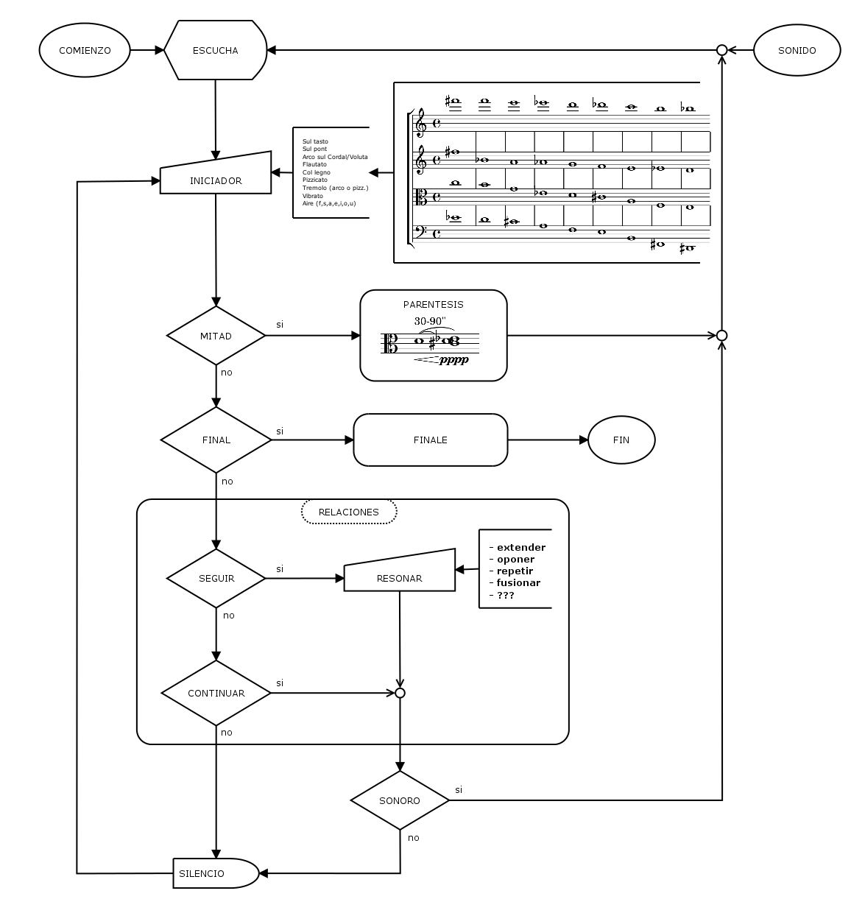
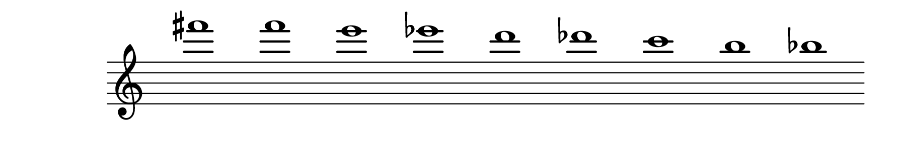
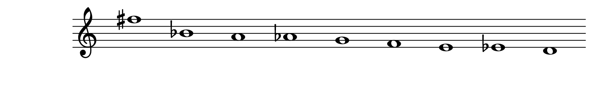
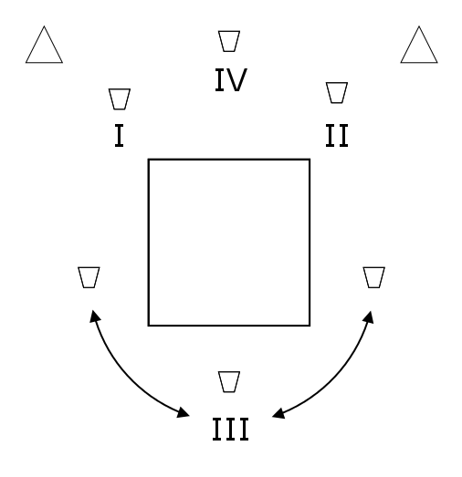

# RELACIONES DE NUBE

## SUGERENCIA

Estas reglas están destinadas al mayor grado posible de incumplimiento, pero al menor grado posible de autoridad.
	
---

## INSTRUMENTACIÓN

-	1 (Un) cuarteto de cuerdas:

Pueden reemplazarse los instrumentos, siempre y cuando haya alguien en el ensemble que tome el rol de 'viola.'

-	2 (Dos o más) parlantes

	
---

##	DINÁMICA Y DURACIÓN

-	La dinámica global de la obra es **pausada** y **silenciosa**.
-	La pieza entera debe durar alrededor de 13 minutos.
	
---

## PISTA ELECTRÓNICA

La pista debe sincronizarse con todos los cronómetros utilizados en la obra, para que todo comience al mismo tiempo.

-	[rec-0-1](puredata/audio/rec-0-1.mp3)
-	[rec-0-2](puredata/audio/rec-0-2.mp3)
-	[rec-0-3](puredata/audio/rec-0-3.mp3)
-	[rec-0-4](puredata/audio/rec-0-4.mp3)
	
---

## DIAGRAMA

A continuación puede verse un [diagrama](diagram/main.png) de la obra. 

	
---

## INICIADORES

Cada intérprete debe reproducir 9 (nueve) sonidos como [INICIADORES](#iniciadores), que pueden o no causar las [RELACIONES](#relaciones).
	
---

### TÉCNICAS

Los intérpretes deben utilizar *todas* las siguientes técnicas, combinando de cualquier manera por lo menos 3 (tres):

1.  Sul tasto
2.  Sul pont
3.  Arco sobre Cordal/Voluta
4.  Flautato
5.  Col legno
6.  Pizzicato
7.  Tremolo (*arco* o *pizz*.)
8.  Vibrato
9.  Agregar *ruido* con aire (con cualquier vocal o consonante fricativa, <&nbsp;*f*&nbsp;> o <&nbsp;*s*&nbsp;>)
	
---

### ALTURAS

Los intérpretes deben utilizar *todas* las siguientes alturas, en esos registros pero en cualquier cuerda:

#### Violin I

#### Violin II

#### Viola

#### Cello

1.  Al menos 3 deben tocarse como *armónicos* en cualquier registro.
2.  Se pueden usar cuerdas dobles al combinar cualquiera de las alturas.
3.  El orden de las notas *no debe estar preestablecido.* Tampoco debe seguirse el orden de las notas como están escritas en la partitura.

	
---

### NO AFINAR

Una vez que se comienza a tocar una altura, se debe ***mantener esa altura***. Nunca ajustar la afinación ni cambiar repentinamente las alturas si la altura no es exacta o no es la deseada. *Si decide hacer glissandi, que sean los más lentos del mundo.*
	
---

## RELACIONES

Los intérpretes deben decidir entre **seguir** o  **no seguir** el sonido, entendiendo a 'sonido' como todo lo que tenga algún efecto acústico en el momento, ya sea de los otros intérpretes, de la pista, del lugar, de los alrededores, la memoria, etc.

**Las relaciones deberían durar entre aproximadamente 15 y 30 segundos**.
	
---

### SEGUIR EL SONIDO

La acción de **seguir el sonido** debe realizarse como una forma (sonora o no) del *resonar*, y puede significar:

1.  Extender el sonido.
2.  Oponerse al sonido.
3.  Repetir el sonido.
4.  Fusionarse con el sonido.
5.  Realizar cualquier otra resonancia que puedan imaginar, con su instrumento, su cuerpo o con cualquier elemento.

#### Excepción

La única excepción de esta regla es que no pueden usarse las alturas utilizadas como [iniciadoras](#iniciadores), porque la resonancia debe ser diferente:

*Por ejemplo, si un intérprete toca un iniciador en Si bemol, entonces no puede sonar ni otro Si bemol, ni ninguna de las alturas escritas.*

	
---

### NO SEGUIR EL SONIDO

La acción de **no seguir el sonido** puede significar:

1.  **Continuar**: continuar  haciendo lo que se esté haciendo.
3.  **Silencio**: casi imperceptiblemente detener lo que se esté haciendo y luego permanecer en silencio hasta realizar algún futuro [iniciador](#iniciadores) o [relación](#relaciones).

	
---

## PARENTESIS

Debe tocarse un *paréntesis* una vez pasada la mitad de la obra.

1.  La **viola** debe tocar el **Re** central ***pppp***, sobre la cuerda de Sol, y con una duración de 30-90 segundos.

2.  Los otros tienen que dejar de hacer lo que están haciendo cuando se dan cuenta de que esto está sucediendo, tocar en ***pppp*** utilizando cualquiera de las técnicas indicadas (la duración está determinada por la viola):
    
    1.  Un intérprete debe *tocar la misma altura*.
    2.  Los dos intérpretes restantes deben tocar cada uno una segunda menor adyacente: **Mib** y **Reb**.
	
---

## VIOLA

1.  Moverse arbitrariamente entre las tres sillas (Ver [Cosas para Viola](#para-viola)).
2.  Puede realizar cualquiera de las siguientes acciones en cualquier momento, pero *también* se deben realizar en los momentos indicados. Deben realizarse muy lentamente y en el rango dinámico más bajo posible:
    1.  Se debe llenar un vaso de agua hasta la mitad (3:15)
    2.  Se debe abrir una lata de gaseosa (6:43)
    3.  Se debe empujar una silla durante 5-10 segundos (7:10)
    4.  Debe sonar una bolsa de plástico durante 10-25 segundos (8:00)

3.  **Solo una vez**, hacer una acción de su elección para seguir algún sonido de la pista.
4.  Estas acciones pueden reemplazar cualquiera de los [iniciadores](#iniciadores), *pero no el [paréntesis](#paréntesis)*.
	
---

## FINALE

El final es una transposición del [PARÉNTESIS](#paréntesis).

Antes de que finalice la cinta (11:00), o en caso que ya haya finalizado, los intérpretes deberían iniciar el final. El final consiste en tocar lo mismo que en paréntesis pero transpuesto a cualquier intervalo, y con cualquier técnica. La dinámica debe seguir siendo ***pppp***. La única condición es que cualquier intérprete *menos la viola* debe iniciar la primera nota; el resto debe continuar el paréntesis de manera transpuesta.

*Los intérpretes (y no la pista) deben finalizar la obra.*
	
---

## INDICACIONES GENERALES

###	UBICACIÓN

-	Los violines 1 y 2 deben colocarse en los dos extremos del escenario, con el violoncello en el centro y en el fondo del escenario. Permanecen sentados.
-	La viola debería poder sentarse detrás de la audiencia, con suficiente espacio para pararse y moverse.
-	Se deben colocar dos altavoces detrás de los violines, y el estéreo debe ser audible.

A continuación puede verse un diagrama de la [ubicación](diagram/stage.png) de los instrumentistas. 

	
---

###	ILUMINACIÓN

La sala debe permanecer oscura todo el tiempo, excepto los cronómetros que iluminan a los intérpretes. Si los cronómetros no tienen luz, debe haber luces individuales y portátiles que apunten a cada intérprete.
	
---

### PARTITURA

Los intérpretes no deben usar una partitura ni ninguna otra ayuda visual que no sea un cronómetro. Deben tratar de recordar qué hacer. Sin embargo, si se olvidan algunas cosas, solo deben seguir tocando.
	
---

## COSAS

### PARA VIOLA

-	3 (Tres) sillas detrás de la audiencia (centro, izquierda y derecha)

Espacializar los siguientes elementos cerca o debajo de algunas de sus sillas:

-	1 (Un) vaso de agua
-	1 (Un) jarra con agua
-	1 (Un) lata nueva de gaseosa
-	1 (Un) bolsa vacía de plástico
-	1 (Un) elemento de elección personal

	
---

### PARA LA PISTA

#### Opción en tiempo real:

-	1 (Un)  instrumentista dedicado a controlar la pista (Ver Anexo)
-	1 (Una) mezcladora conectada a los dos parlantes.
-	1 (Una) interfase de audio (USB), conectada a la mezcladora con cables TRS.
-	1 (Una) computadora con Pure Data, conectada con la interfase via USB.

#### Opción en tiempo diferido:

-	1 (Un)  reproductor de audio conectado a los dos parlantes.

	
---

### PARA INSTRUMENTISTAS

-	Un cronómetro para cada instrumentista (con o sin luz)
-	Una luz (led) individual y portátil para cada instrumentista
-	Una silla para cada instrumentista (excepto Viola que necesita tres)

	
---

